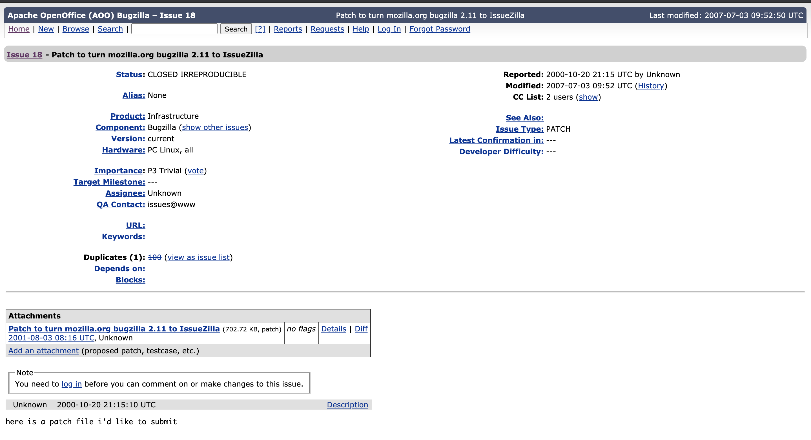

# A Soft Alignment Model for Bug Deduplication

年份: 2020

老paper重读了，每次都有新收获。

# 问题

- duplicate bug report detection
- bug report deduplicateion
- bug deduplication

distinct reports related to the same software issues

bug和bug report这两个词总有点重复，在本文里就认为他们是一个意思

# Approach

a soft-attention alignment to improve duplicate bug report detection

对于给定的一对可能是重复的reports，the attention mechanism 计算 interdependent representations for each report

在四个广泛使用的datasets是进行评估，是在ranking-based metric，比decision-making metrics更实际

- ranking-based metric: for a given new report, the proposed method will generate a list of the K most likely duplicate reports
- decision-making metric:

总得来说，traning的数据集和方法都一样，不一样的是评估指标

> bug tracking system: bugzilla, JIRA

a triage team manually labels new reports as duplicate or not

### 为什么会有这么多duplicate bug reports?

heterogeneous environment, 因为in open source projects, bug reports can be submitted by developers, testers, and even end users

### bug report

- summary
- description
- categorical fields, e.g., system, component and version

Open Office bug reports: [https://bz.apache.org/ooo/](https://bz.apache.org/ooo/)

下面是一个例子，bug id = 18，来自open office数据集

```json
{
	"bug_id":"18",
	"product":"Infrastructure",
	"description":"here is a patch file i'd like to submit",
	"bug_severity":"trivial",
	"dup_id":[],
	"short_desc":"Patch to turn mozilla.org bugzilla 2.11 to IssueZilla",
	"priority":"P3",
	"version":"current",
	"component":"Bugzilla",
	"delta_ts":"2007-07-03 09:52:50 +0000",
	"bug_status":"CLOSED",
	"creation_ts":"2000-10-20 21:15:00 +0000",
	"resolution":"IRREPRODUCIBLE"
}
```

再看网页[https://bz.apache.org/ooo/show_bug.cgi?id=18](https://bz.apache.org/ooo/show_bug.cgi?id=18)上的截图



从这个图上可以看出，short_desc就是title

### Soft-alignment

A novel deep learning network that produces **joint representations of reports based on a soft-attention alignment mechanism**

key component: a layer that compares each word in a report with a fixed-length representation of all words in the other one. 

**Related work:** Poddar et al. also use an attention mechanism, our proposed architecture is able to summarize relevant information within one report conditioned to a specific segment of the other report.

### Soft Alignment Model for Bug Deduplication

- categorical module
- textual module: the most informative features are the summary and description texts

**four layers:**

- textual embedding: This layer independently transforms the words from the query and candidate texts into real vectors (word embeddings)
- soft alignment comparison
- textual encoder: This layer takes the variable-size representation of a report text (query or candidate) and produces a fixed-size representation
- textual comparison: compares the textual representations of both reports

## Evaluation

1. Sort the bug report in BTS by their creation date
2. group the reports in the training set that describe the same bug into buckets, set master report and the remaining ones are duplicate ones

### mean average precision (MAP) and recall rate@k (RR@k)

In this study, a bucket is considered to be a candidate when at least one of its reports is within the defined time window

## Some Thoughts

Extending the window span from one to three years decreases the number of duplicate bug reports whose ranked list never contains the correct master reports.

也就是说，给出prediction的结果时，是给定master id

是否duplicate bug report的duplicate id都是master id？

会不会出现 2 : 1, 3 : 2这样的情况呢？检查一下数据集

master id的作用是啥？减少比较次数？