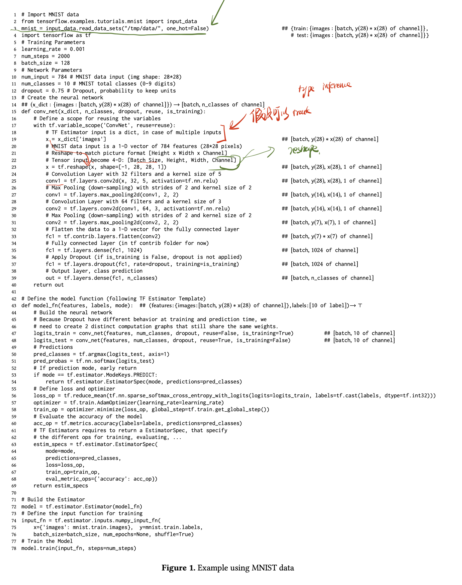

# Ariadne: Analysis for Machine Learning Programs

## Motivate to read
最近在着手做static analysis for AI system.说实话这一块的工作并不是很多，这就是其中一篇。此外我对static analysis并没有很多的经验，可以从这篇文章中学习一下基本的概念。
这一篇论文我估计会花几天去认真阅读，先写一部分内容在这里，之后继续补足。

## Concepts
我对static analysis了解并不多，因此有一些新概念需要仔细地了解，先列举在这里：
* type system

## Main contribution
> We report on Ariadne: applying a static framework, WALA, to machine learning code that uses Tensorflow. We have created static analysis for Python, a type system for tracking tensors, and a data flow analysis to track their usage. 

## Background

> Machine learning code is commonly written in Python, in part because of its wealth of machine learning libraries, but also reflecting a more-general trend toward dynamic programming languages. While these languages are often felt to make development faster, the price is having less error detection at code creation time.

动态语言写起来更加方便，但是error detection更难一点。比如我们使用`print(a + ' ' + str_b)`可能会报错，说`a`是一个整数而并非字符串。而有些时候，可能不会报错，但是引入了bug。

> This is especially problematic for machine learning: due to its statistical nature, code with subtle errors may run and produce results that look plausible but are meaningless.

机器学习程序也存在同样的问题。尤其是statstical nature (flaky)，程序可以正常运行，而结果更难debug.

> Supportive tooling could ameliorate such problems, but it is less sophisticated for dynamic languages, in large part because such tooling is usually driven by static types that these languages lack.

有工具可以缓解类似的问题，但是这些工具通常都需要static types，而动态语言比如Python并没有。

## Motvation Example

