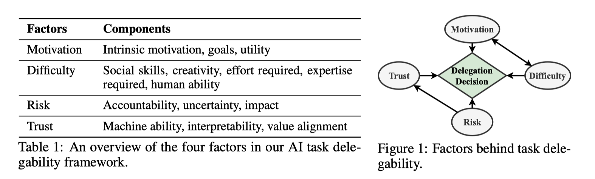

# Ask not what AI can do, but what AI should do: Towards a framework of task delegability

这篇文章讨论的并不是我在Ethical Guidelines中看到的"Control Delegation"，这里的task delegability指的是对于一个任务，人们有多大的意愿，以及在何种程度上让AI来执行。这delegability分为四个层面：

1. Human Only
2. Machine-in-the-loop: 人主导，machine辅助
3. Human-in-the-loop：machine主导，人辅助
4. Full Automation 完全由机器主导

对于一个任务，作者设置了四个指标，分别是motivation, difficulty, risk和trust。通过survey的方式，让人从这四个维度进行评价，并且给出对于此任务delegability的偏好。通过survey收集数据，使得可以empirically分析此问题。也得到了一些结论：

- 四个因素当中，trust与delegability最相关；而可解释性（trust的一个部分）并没有和delegability体现出很强的相关度。
- 参与者很少偏好full automation，而倾向于AI辅助(machine in the loop)

我能从这篇文章中学到不少事情。首先，NIPS也并不是需要新颖的模型和硬核的数学以及出色的效果才能发论文。另辟蹊径，考虑一些人们不经常考虑的基础问题也可以发论文。如这篇论文一样，community都在向着AI automation的角度进发，而什么任务应该自动化，什么不应该自动化却很少有人讨论。而这也给AI+CHI的研究留下了空间。

另一个是，可以通过survey的方式，empirically分析问题。这个文章中的一些概念非常的“不数学”，比如task delegability, trust, risk等等。但是可以通过问卷的方式，得到一些量表后分析correlation。假设数字的大小和指标相关，某些指标之间存在相关性。

文章对于一些抽象概念的解释也很值得学习，比如对于Motivation，将Motivation分成intrinsic motivation和goal，并且引入utility。将Difficulty分为social skills, creativity, effort required, expertise required, human ability...

此外，这篇文章的一些表述，也可以作为我其他文章的motivation。比如：

> Milewski and Lewis [33] suggest that people may not want to delegate to machines in tasks characterized by low trust or low confidence, where automation is unnecessary, or where automation does not add to utility.

这句话描述的场景可以作为Trustworthy BL in Industry的motivation。如果BL工具可能会产生错误的推荐，那么人们并不倾向于使用它。

> We find that our survey participants seldom prefer full automation, but value AI assistance. Among the four factors, trust is the most correlated with human preferences of delegability.

这说明了trsut很重要，也显得delegate back to human很重要。

数据在此：[https://delegability.github.io/table.html#](https://delegability.github.io/table.html#)