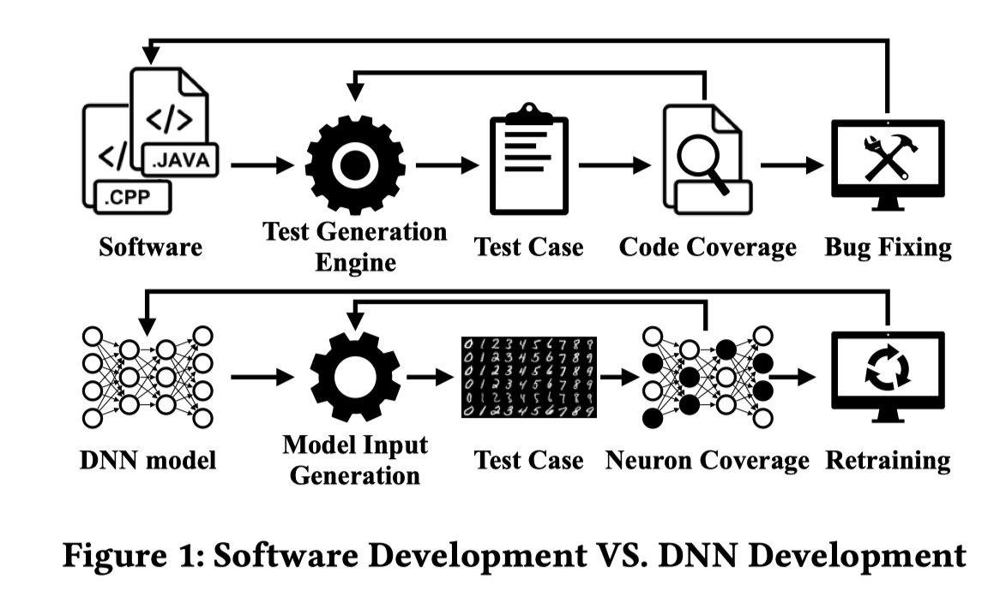

# Correlations between Deep Neural Network Model Coverage Criteria and Model Quality

## Motivation to read
最近想转做一些关于Ai testing的内容，需要提前了解一下相关的论文。

## 需要明确的几个概念
* 什么是DNN model quality?
* Sematic of program
* 什么是neural network coverage
> neuron coverage measures the percentage of neurons that are activated, analogous to statement coverage

DNN有输入层和输出层，以及一堆内部层(inner layer)。神经网络进行预测时，某一层的neuron activation values是基于上一层的结果进行计算。对某一个神经元而言，如果activation value小于0，就会被直接设置为0（ReLu），因此我们认为它has 0 contribution to the later layers.我们将这种情况就成为该神经元没有被激活。
研究者将神经元是否被激活，类比为代码(比如一条语句)是否被覆盖。因此我们就能基于神经元是否被激活，提出一系列neuron coverage的标准。比如：
* neuron coverage: 神经元被激活的比例
* neuron pattern coverage: 覆盖到的activation path

## 核心问题
> Inspired by the great success of using code coverage as guidance in software testing, a lot of neural network coverage criteria have been proposed to guide testing of neural network models (e.g., model accuracy under adversarial attacks). However, while the monotonic relation between code coverage and software quality has been supported by many seminal studies in software engineering, it remains largely unclear whether similar monotonicity exists between neural network model coverage and model quality. This paper sets out to answer this question. Specifically, this paper studies the correlation between DNN model quality and coverage criteria, effects of coverage guided adversarial example generation compared with gradient decent based methods, effectiveness of coverage based retraining compared with existing adversarial training, and the internal relationships among coverage criteria.

在传统的软件测试中，code coverage是一个重要指标，因此现在也提出了很多关于神经网络哦行的coverage标准，比如model accuracy under adversarial attacks. 很多研究表明(empirically)，在软件工程中，代码覆盖率和软件质量之间存在递增的关系；但是神经网络模型和neural network model coverage之间是否存在类似的递增关系还不清楚。这篇文章主要是为了回答此问题。详细来说：
1. DNN模型的质量和coverage criteria之间的相关性
2. 比较coverage guided adversarial example generation和gradient decent based adversarial example generation攻击的有效性
3. 比较coverage based retraining和existing adversarial training的效果
4. internal relationships among coverage criteria

## 一些观点
> In fact, the semantics of DNN models is substantially different from the semantics of programs. The syntactic analogy between software statements and neurons may not directly translate to their semantic analogy.

程序语义和DNN模型的语义不同，因此模型质量是否随coverage递增我们不知道。
这句话我很喜欢，语义上的类比和语法上的类比。再比如，我们之前想用CodeBERT来做Bug Localization和Duplicate Bug Report Detection，或者IR community想把BERT用在information retrival。先使用BERT做word embedding，然后计算相似度。这样的类比，也是一种“语法上的类比”，而语义我们并不知道。我之前就和ZX提过这个观点，但是没有办法很好地概括表达。
不过我们的确可以顺着这个思路去找，比如找到BERT的“语义”，用符合语义的计算方法；或是让BERT生成IR语义的表达。

> Intuitively, program behaviors are largely discrete whereas model behaviors are continuous. A statement being covered suggests that new functionality is exercised, which is a discrete and modular event. However, a neuron being activated may not have similar implication. It may well be that the semantics of a model lies in the distribution of the entire activation vector instead of a set of discrete events of whether individual neurons are activated.

## 抄点作业
这里记录一些不错的关于背景的阐述，也许之后有用。

> Deep Neural Network (DNN) is becoming an integral part of the new generation of software systems, such as self-driving vehicle systems, computer vision systems, and various kinds of bot systems.

阐述DNN的重要性

> Just like software testing is a key step in traditional software development life-cycle, many researchers and practitioners believe that DNN model testing is critical to model quality and hence the whole system quality

阐述DNN model testing的重要性。在关于ML project testing中也可以提到这样的内容。

> Specifically, white-box testing aims to generate test cases to improve code coverage. High code coverage provides more confidence about the subject software’s quality.

> Code coverage criteria play a critical role in software (white-box) testing.

阐述覆盖率的重要性

> A large number of coverage criteria have been proposed and used. For example, statement coverage measures the percentage of statements that are executed by a test suite; edge coverage measures the percentage of exercised control flow edges; and path coverage measures the percentage of program paths that get executed. Different criteria have different levels of strength (in disclosing bugs) and entail various amount of efforts. Specifically, statement coverage is the simplest and also the weakest, whereas path coverage is one of the most expensive and most powerful. These criteria provide a spectrum of options for developers when they are balancing development cost and product quality.

对几种coverage的介绍

> Given a subject software, various test generation engines, such as random input generation, fuzzing, symbolic execution, search based test generation, can be used to generate test cases. The generated test suite is executed and the code coverage is measured and provided as feed-back to the test generation engine, whose goal is hence to generate more test cases that can improve coverage. The failing test cases are reported to the developers who fix the corresponding faults/bugs/defects, leading to a new version of the subject software.

生成测试用例的一些技术手段

