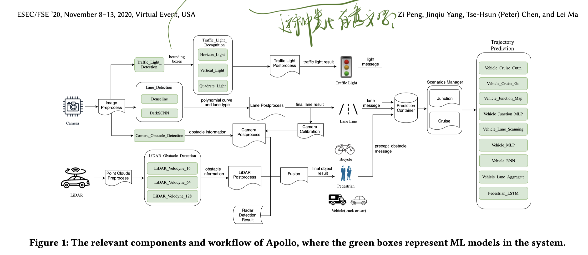

# A First Look at the Integration of Machine Learning Models in Complex Autonomous Driving Systems

## Motivation: Why I read this paper?
Currently, I am working on analyzing trustworthy AI systems with static analysis. In recent years, the research community has made significant breakthroughs in machine learning algorithms and practical application. But little work has been done on analysing the AI-powered system. I don't want to target at AI models (single module in a system) only. Instead, I want to proceed with this project from a systematic perspective. 

This paper takes a first look at the integration of machine learning models in the autonomous driving system, which is helpful for me to understand my project, e.g. the feasibility to analyzing a large-scale autonomous driving system.

## Metadata
Zi Peng, Jinqiu Yang, Tse-Hsun (Peter) Chen, and Lei Ma. 2020. A first look at the integration of machine learning models in complex autonomous driving systems: a case study on Apollo. In Proceedings of the 28th ACM Joint Meeting on European Software Engineering Conference and Symposium on the Foundations of Software Engineering (ESEC/FSE 2020). Association for Computing Machinery, New York, NY, USA, 1240–1250. DOI:https://doi.org/10.1145/3368089.3417063

## Insights and Ideas

> Despite extensive study on ML models, it still lacks a comprehensive empirical study towards understanding the ML model roles, peculiar architecture and complexity of ADS.

> We present our findings on how the ML models interact with each other, and how the ML models are integrated with code logic to form a complex system.

Well, at least it proves that the Apollo system can be analyzed by several researchers.

> lack of adequate tests in general

Although automated driving system is safety-critical, it still lacks of adequate tests in general. Lack of manpower may explain the problem, but can the system be "no-easy-to-test"? Put a new word here -- testability which represents the difficulty to test a software system. Maybe the testability is low and how can we improve it? I don't know whether there are similar concepts in software engineering communities.

> ADS aims to automate the vehicle driving process without the need of human intervention.

> The main goal is to create a driverless system that can intelligently navigate a vehicle with full automation.

The utlimate goal looks promising but the European's ethical guidelines for trustworthy AI requires that human can take over the system at any time.

> differential testing

Find a concept. From Wiki:
> Differential testing,[1] also known as differential fuzzing, is a popular software testing technique that attempts to detect bugs, by providing the same input to a series of similar applications (or to different implementations of the same application), and observing differences in their execution. Differential testing complements traditional software testing, because it is well-suited to find semantic or logic bugs that do not exhibit explicit erroneous behaviors like crashes or assertion failures. Differential testing is sometimes called back-to-back testing.

> Although prior studies have shown promising results in testing ML models for ADS systems, these studies only consider the testing of only ML models independently at unit level. However, in reality, there may be various ML models that work collaboratively based on the information received from different cameras and sensors.

It is the case but researchers may not be able to afford to do system testing.

> For example, ADS may utilize code logic to provide some resilience to noises in these in the captured images. Therefore, understanding how ML models interact with each other and their integration with code logic in ADS may open up new avenues to future research and practice on the quality assurance of ADS.

**It's important to understand how ML models interact with each other and their integration with code logic.**

> We position this paper as a first step to understand the complexity to integrate ML models and code logic in real-world ML-powered systems. Such complexity calls for collaborative effort from both researchers and practitioners to further improve the quality assurance of ML-powered systems.

> To assess how frequently ML models are used in the simulated production run, we inserted logging statements in each method in Apollo, and analyzed the generated logs by executing Apollo in the simulator using the recorded playback.

在Results and Implication部分，提到了哪些被测试了；这个思路没准也可以用在Ratna的项目中。这个box plot没准也可以用

## Research Questions

### RQ1. What is the ML model architecture and relevant information flow in Apollo
#### Motivation
> Extensive studies have been performed on testing and analysis a ML component level, which is an important first step for system-level analysis. In practice, a ML model is often not used stand-alone.

> Up to present, it still lacks a study to perform an in-depth analysis of how an ML model is used in a complex ML-powered system, e.g. the roles of these ML models and how they interact with traditional software, together forming a larger system.

> This study intends to bridge this gap in performing a comprehensive study on the typical complex ML-powered system.

> Understanding the types and functionality of these ML models would be an important first step to facilitate future research on quality assurance of ADS and ML-powered system testing in general.

A good logic to state motivations. 1) Background -> 2) Lack of solution -> 3) High-level summary of contribution -> 4) Meaning

#### Approach

写一些看这部分时闪现的想法：
* 描述了如何进行“自动化与手动结合”的方法，类似的说法也可以用在SyntaxRePro的论文中。
* Apollo自动驾驶系统是开源的，这很好；但是这种清晰的开源架构让攻击更加容易，因而随机化的策略才重要。这可以作为David上次说的Moving Target + NN Defense的motivation。如果我们做这个工作，是否有办法进行系统化的测试，而非仅仅是从简单地从模型角度测试。
* 这“决策传递”的图像不像马尔可夫过程？这种类比有意义吗？错误的传递？Subsequence decision, cascading error? 如果从信息论的角度出发呢？这是一个熵增的过程。(Just some nonsense)

#### Discussion and Implication
> Future studies should provide support to ML model management and evolution.

> Moreover, deciding which ML model to use can be a challenging decision. Future studies should provide support to developers on choosing the optimal ML model for a given task under different situations (e.g. different cities), and help developers maintain variants of the models.

或者和security game theory或优化问题结合起来：用什么样的策略来组合使用这些模型呢？

> Some functionalities of ADS rely on HD map, which may be a single point of failure.

这确实是一个问题，决策完全依赖于这里。如果这里出问题，那之后的决策很大程度上会收到影响。那如何避免这个问题呢？这还是一个开放问题，正如作者所说的：

> Future studies may consider testing the impact of HD map or V2X on the decision of ADS.

### RQ2. What are the relationship and interaction between code modules and ML models?

#### Motivation
> The interactions may further complicate ML model testing and pose new challenges in the integration testing between the models and code modules. For example, the output from one model may be in diverse data formats, become part of the input of several ML models, and require proper validation before inputting to other ML model or code logic.

> Therefore, to provide guidance on future research on improving the testing of AI-powered system, in this RQ, we present our analysis results on the ML model interactions and how code plays a role in such interactions, e.g. pre-, post-processing and validation steps.

之前看到过一篇论文，用static analysis来做ML的数据接口/格式的分析，没准可以用来处理这个问题？

#### Apollo中模型间交互的几种模式
* All the output of one ML model is used exclusively and entirely by another ML model as input.
* The output of one ML model is used to post-process the output of another ML model
* The outputs of several ML models are combined together as another ML model's input
* Given the diverse ML model interactions, code modules play non-trivial roles in such interactions.

> The data-driven and probabilistic nature of Ml models makes it unable to reach 100% general accuracy in practice.

#### Implication
* Future studies should consider testing and the use of ML models for different scenarios of the same task.
* Future studies should investigate the maintenance challenges of the code logic in Ml model interactions.
* Future studies should consider testing the integrated behaviors of ML models and code logic.'

## How to Organize Research Questions
这篇论文阐述Research Questions的方式可以借鉴。按照1) Motivation, 2) Approach, 3) Results, 4) Discussion and Implication进行阐述。可能是因为Research Question的内部联系的很紧密。